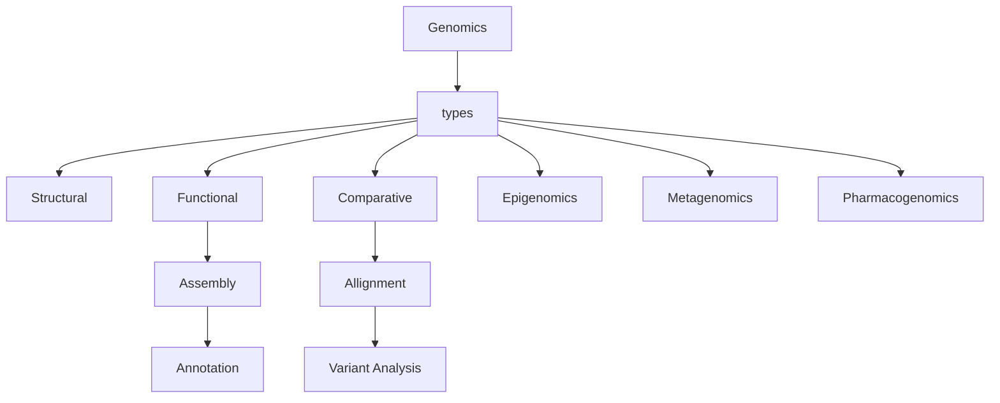

# Part-2: Genomics



</br>

Genomics is the study of the complete set of genetic material (DNA) within an organism. There are several types of genomics, including:

**Structural genomics**: This type of genomics involves the study of the organization and structure of the genome, including the mapping and sequencing of DNA.

**Functional genomics:** This type of genomics focuses on understanding the functions of genes and how they interact with each other within the genome.

**Comparative genomics:** This type of genomics involves comparing the genomes of different organisms to identify similarities and differences between them, with the goal of understanding evolutionary relationships.

**Epigenomics:** This type of genomics focuses on the study of epigenetic modifications to DNA, such as methylation, which can influence gene expression and function.

**Metagenomics:** This type of genomics involves the study of genetic material recovered directly from environmental samples, such as soil or water, to identify and analyze the genomes of the organisms present in those samples.

**Pharmacogenomics:** This type of genomics involves the study of how an individual's genetic makeup influences their response to drugs, with the goal of developing personalized medicine.

## Genomic technologies

1. **Quality analysis and Filtering** (This involves assessing the quality of the sequencing data and filtering out low-quality reads.)
2. **Mapping** (aligning the reads to a reference genome to identify where they came from.)
3. **Assembling Genome** (piecing together the reads into longer sequences, known as contigs, to reconstruct the original genome)
4. **Visualizing** (graphical representations of the genome)

## Quality analysis and Filtering Technique

### Getting the raw data

Create a project directory

```bash
mkdir compbiogenomics
```

If we want to use the hpc then access the shell and type the following commands

```bash
scp username@owens.osc.edu:/users/PGS0299/usernameaelias/compbio_demo/SR* ./compbiogenomics/
```

to read the gz file:

```bash
chmod u-w ./*
```

read the data

```bash
zless SRR957824_500K_R1.fastq.gz
```

</br>

### Analyzing FastQC

FastQC is a popular open-source software tool for quality control analysis of high-throughput sequencing data. Install it first

```bash
sudo apt install fastqc
```

analyze the quality of your sequencing reads

```bash
fastqc SRR957824_500K_R*
```

> FastQC will generate a set of HTML reports that summarize various quality metrics for the sequencing data. These metrics may include read length, base quality scores, sequencing errors, adapter content, and GC content. This information can be used to identify potential issues with the sequencing data and to guide further data preprocessing and analysis steps, such as read trimming or filtering.

read the html in browser

```bash
xdg-open SRR957824_500K_R1_fastqc.html
```

### Filtering with fastp

`fastp` tool used for pre-processing and filtering of next-generation sequencing data. It can perform quality control, adapter trimming, error correction, and filtering of low-quality reads, PCR duplicates, and overrepresented sequences.

```bash
sudo apt install fastp
```

```bash
fastp --detect_adapter_for_pe --overrepresentation_analysis --correction --cut_right --thread 2 --html trimmed_fastp.html --json trimmed_fastp.json -i SRR957824_500K_R1.fastq.gz -I SRR957824_500K_R2.fastq.gz -o trmmed_SRR957824_500K_R1.fastq.gz -O trimmed_SRR957824_500K_R2.fastq.gz
```

> **--detect_adapter_for_pe:** automatically detect and trim adapter sequences for paired-end reads. </br>
**--overrepresentation_analysis:** perform an over-representation analysis to identify and filter out PCR duplicates, low complexity reads, and reads containing sequencing artifacts. </br>
**--correction:** perform error correction on sequencing reads to reduce the impact of sequencing errors on downstream analysis. </br>
**--cut_right:** trim a fixed number of bases from the right end of each read. </br>
**--thread 2:** use 2 threads to speed up the processing. </br>
**--html trimmed_fastp.html:** generate an HTML report file with summary statistics and quality control plots. </br>
**--json trimmed_fastp.json:** generate a JSON file with detailed information on the preprocessing steps. </br>
**-i SRR957824_500K_R1.fastq.gz:** specify the input file for the first read pair. </br>
**-I SRR957824_500K_R2.fastq.gz:** specify the input file for the second read pair. </br>
**-o trmmed_SRR957824_500K_R1.fastq.gz:** specify the output file for the first read pair after preprocessing. </br>
**-O trimmed_SRR957824_500K_R2.fastq.gz:** specify the output file for the second read pair after preprocessing. </br>

-syntaxs inshort
> --detect_adapter_for_pe = i am providing a parant sequence and asking to detect adaptor for pe </br>
--overrepresentation_analysis = find any overrepresentation </br>
--cut_right = which portion to cut </br>
--thread = core/node </br>
--html trimmed_fastp.html --json = output file </br>
-i = input file </br>
-I = second pair </br>
-o = output file </br>
-O = second output file </br>

### Generate quality reports

generating a summary report of quality control metrics from multiple bioinformatics analyses. It allows users to aggregate and visualize quality control information from various tools and data types in a single report.

```bash
$multiqc
```

specify data input and output

```bash
multiqc -o /path/to/output /path/to/data/*
```

> multiqc: This is the name of the multiqc tool that is being invoked. </br>
-o: This option specifies the output directory where the generated report will be saved. Replace /path/to/output with the desired path to the output directory. </br>
-/path/to/data/*: This specifies the path to the data directory where the input data files are stored. Replace /path/to/data with the path to the directory containing the data files. </br>
The `*` character is a wildcard that will match any files in the directory.

## Mapping

### Editing fasta file if needed

```bash
$wget https://github.com/shenwei356/seqkit/releases/download/v2.3.1/seqkit_linux_386.tar.gz
```

```bash
$tar -xvf seqkit_linux_386.tar.gz
```

```bash
$nano test.fa
```

```bash
$./seqkit seq -w 60 test > test2.fa
```

### Getting the genome

```bash
$scp sabrinaelias@owens.osc.edu:/users/PGS0299/sabrinaelias/compbio_demo/SR* ./compbiogenomics/gunzip GCF_001612495.1_ASM161249v1_genomic.fna.gz
```

```bash
$gunzip GCF_001612495.1_ASM161249v1_genomic.fna.gz
```

### Mapping using bowtie2

```bash
$sudo apt install bowtie2
```

```bash
$bowtie2 GCF_001612495.1_ASM161249v1_genomic.fna
```

</br>

Index file for bowtie

```bash
$bowtie2-build GCF_001612495.1_ASM161249v1_genomic.fna GCF_001612495.1 _ASM161249v1_genomic.fna.fai
```

```bash
$bowtie2 -x GCF_001612495.1_ASM161249v1_genomic.fna.fai -1 ../../trimmed_SRR957824_500K_R1.fastq.gz -2 ../../trimmed_SRR957824_500K_R2.fastq.gz -S ecoli.sam
```

```bash
$less ecoli.sam
```

### sorting and indexing using samtools (chromosome wise and position wise)

```bash
$sudo apt install samtools
```

```bash
$samtools view -bS ecoli.sam > ecoli.bam
```

```bash
$samtools sort ecoli.bam -o ecoli_bowtie2_sorted.bam
```

```bash
$samtools faidx GCF_001612495.1_ASM161249v1_genomic.fna
```

```bash
$samtools index ecoli_bowtie2_sorted.bam
```

### Viewing the alignment

```bash
$sudo apt install igv
```

```bash
igv
```

```bash
$samtools tview ecoli_bowtie2_sorted.bam
```

```bash
$samtools depth ecoli_bowtie2_sorted.bam | awk '{sum+=$3} END { print "Average = ",sum/NR}'
```

## Assembling Genome

```bash
sudo apt install ray (Ray is for creating contig)
```

```bash
Ray k 31 -s Reads_split.fa -o new_mtRay
```

[Ray manual](https://denovoassembler.sourceforge.net/manual.html)

</br>

syntaxs:

```bash
-s = single fastq file
-p = parent fastq
```

## scaffolding (pairing ending)

```bash
perl SSPACE_Basic_v2.0.pl -l ../librarries.txt -s ../new_mtRay/Contigs.
```

```bash
fasta -k 5 aq 0.7 -x 0 -T 24 -b nw_SC_all
```

```bash
perl SSPACE_Basic_v2.0.pl -l libraries.txt -s ../new_mtRay/Contigs.fasta -k 5 aq 0.7 -x 0 -T 24 -b nw_SC_all
```

## variant calling

vcf = variant calling format file

in this file (insertion and deletion position number and ranges)

to see the genome difference and gene number

## Visulaization

How may we visualize. We may use igv

## Further analysis

### Gene annotaion

we can use rust package. `SNPEFF`

### Gene prediction

we may use `AUGUSTUS` package

### Protein level investigation

---

## My notes

aligning

basic terminologies

sequencing adaptor binding site

reversible dye terminator

can sequence the rna (pacbio and nanopore technology companies)

Ion torrent

Types: structural, functional and comparative

laboratry
NGS
Analysis (quality, alignment, variant, annotaion)
visulaization
proritization
storage

Assembly:
de-novo and reference guided assembly

Tools

1. fastqc
2. fastp
3. multiqc
4. bowtie2

---

## Hands on basic Commands notes

to read a gz file aminoacid seq length

```bash
grep -c "@" [filename] \*
```

```bash
fastqc {filename} (to run the gz file)
```

```bash
xdg-open [filename].html (to see the report)
```

```bash
zless [filename] (to show the trimmed output files)
```

```bash
scp(sequerd copy) -r (directory) [folder name] [destinaitonplace]
scp -r [folder] hasanur069@owens.osc.edu:/user/PGA0299/hasanur069/
scp -r [folder] hasanur069@owens.osc.edu:~/
```

`same action: ~/ = Home, $HOME`

check modules in osc:

```bash
module spider
module spider bowtie2
```

fastqc --help

---

Mapping genome

we need a reference sequence to map

1. Unzip the file gunzip [filename]
2. bowtie2 GCF_001612495.1_ASM161249v1_genomic.fna
3. bowtie2-build GCF_001612495.1_ASM161249v1_genomic.fna GCF_001612495.1_ASM161249v1_genomic.fna.fai

`top` {to see the cpu usages and running job}

`Contigs.fasta` (upload) resfinder (resistence gene)

`to read the contigs: grep -c ">" new_mtRay/Scaffolds.fasta`
